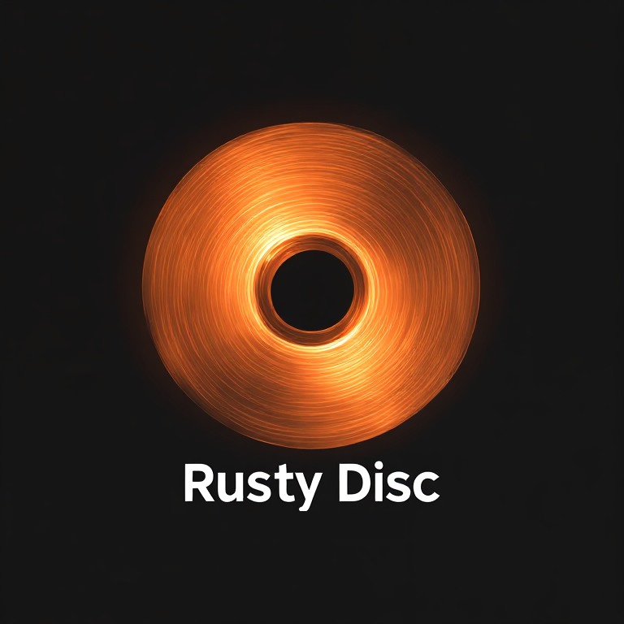

<p align="center">
  
</p>

<p align="center">
  <em>A blazing-fast optical disc toolkit for Linux — burn, rip, archive, and verify<br>Red Book audio CDs, Data CDs, and Blue Book/CD Extra enhanced discs.</em>
</p>

<p align="center">
  
  
  
</p>

---

## Contents

- [Overview](#overview)
- [Features](#features)
- [System Requirements](#system-requirements)
- [Installation](#installation)
- [Quick Start](#quick-start)
- [Disc Formats](#disc-formats)
- [Commands](#commands)
  - [info](#rustydisc-info)
  - [burn](#rustydisc-burn)
  - [rip](#rustydisc-rip)
  - [verify](#rustydisc-verify)
  - [plan](#rustydisc-plan)
  - [validate](#rustydisc-validate)
  - [recover](#rustydisc-recover)
- [Usage Examples](#usage-examples)
  - [Inspecting a Disc](#inspecting-a-disc)
  - [Ripping Audio CDs](#ripping-audio-cds)
  - [Ripping Data CDs](#ripping-data-cds)
  - [Ripping Blue Book / CD Extra](#ripping-blue-book--cd-extra)
  - [Archive Mode](#archive-mode)
  - [Verifying an Archive](#verifying-an-archive)
  - [Red Book Audio CDs](#red-book-audio-cds)
  - [Data CDs](#data-cds)
  - [Blue Book / CD Extra](#blue-book--cd-extra)
  - [Playlists (M3U/M3U8)](#playlists-m3um3u8)
  - [Transcoding with FFmpeg](#transcoding-with-ffmpeg)
  - [Multi-Disc Burning](#multi-disc-burning)
  - [CD-Text from Tags](#cd-text-from-tags)
  - [CD-RW Operations](#cd-rw-operations)
- [Disc Graph JSON](#disc-graph-json)
- [Error Handling](#error-handling)
- [Hardware Notes](#hardware-notes)
- [Development](#development)
- [License](#license)

---

## Overview

Rusty Disc treats optical discs as structured objects, not just files. The core abstraction is the **DiscGraph** — a unified intermediate representation that drives both directions of the pipeline:

```
          DiscGraph
         /         \
   Burn Plan     Rip Plan
        ↓             ↑
   Physical Disc ↔ Physical Disc
```

Burning and ripping are inverse operations of the same graph. You describe what you want (tracks, files, format, label), RustyDisc figures out the rest.

**Burn pipeline:**
```
CLI flags / JSON graph
        │
        ▼
  Disc Intent Parser      ← validates input, resolves playlists, reads tags
        │
        ▼
   Disc Graph Builder     ← unified intermediate representation
        │
        ▼
   Session Planner        ← enforces Red/Blue Book rules, checks WAV specs
        │
        ▼
 Backend Execution Layer  ← cdrdao (audio), xorriso (data/ISO), ffmpeg (transcode)
        │
        ▼
  Hardware Device Layer   ← ATIP detection, buffer underrun guard, multi-session
```

**Rip pipeline:**
```
Physical Disc
        │
        ▼
  Disc Analyzer           ← reads TOC, detects format, extracts CD-Text
        │
        ▼
    Rip Planner           ← determines what to extract and how
        │
        ▼
  Secure Rip Engine       ← cdparanoia (EAC-grade: multiple reads, jitter correction, C2 errors)
        │
        ▼
   Audio Encoders         ← ffmpeg → WAV / FLAC / ALAC / AIFF / OGG / MP3 / Opus
   Data Extractor         ← xorriso → directory tree or ISO image
        │
        ▼
  Metadata + Checksums    ← cdtext.json, disc.json, checksums.json (SHA256)
```

Format constraints are enforced **before** any hardware is touched, so you get a clear error rather than a half-burned coaster.

---

## Features

### Burning
- **Three disc formats** — Red Book Audio, ISO9660 Data CD, Blue Book/CD Extra enhanced CD
- **Playlist support** — burn directly from an M3U or M3U8 playlist, durations read from `#EXTINF` tags
- **FFmpeg transcoding** — convert any audio format to MP3, AAC, Opus, FLAC, or WAV before burning; stage and clean up automatically
- **Multi-disc splitting** — automatically detects when content exceeds a single disc and prompts you to swap discs
- **CD-Text from tags** — reads track title, artist, and album from embedded metadata (ID3, Vorbis, etc.) and writes it to the disc lead-in
- **Disc state detection** — uses ATIP to reliably distinguish blank, appendable, and finalized discs
- **CD-RW guard** — blocks multi-session Blue Book burns on rewriteable media
- **Buffer underrun protection detection** — warns if your drive lacks BURN-Proof/SMART-BURN
- **Dry run mode** — `--dry-run` prints the full execution plan as JSON without touching hardware

### Ripping
- **Secure audio extraction** — cdparanoia backend: multiple reads per sector, jitter correction, C2 error pointer support, paranoia retry logic — equivalent to EAC quality
- **Seven audio output formats** — WAV, FLAC (level 8 compression), ALAC, AIFF, OGG Vorbis, MP3 (VBR best), Opus (320kbps)
- **Automatic disc detection** — `rustydisc info` and `rustydisc rip` auto-detect Red Book, Data CD, and Blue Book without needing to specify the type
- **CD-Text preservation** — reads CD-Text from disc via cdrdao, embeds tags into every encoded audio file automatically
- **Blue Book session-aware ripping** — extracts audio and data sessions independently into `audio/` and `data/` subdirectories
- **Data session extraction** — xorriso extracts the ISO filesystem as a directory tree; ISO image output also supported
- **Archive mode** — `--archive` produces a complete reconstruction kit: `disc.json` + `cdtext.json` + `checksums.json`
- **SHA256 verification** — `rustydisc verify` checks every ripped file against its stored checksum

### General
- **Structured errors** — every error is machine-readable JSON with a code, message, and `recoverable` flag
- **Machine-readable progress** — `--progress-json` emits newline-delimited JSON events for integration with frontends (e.g. TrackBridge)

---

## System Requirements

### Runtime dependencies

| Tool | Purpose | Required for |
|------|---------|-------------|
| `cdrdao` | Red Book audio DAO burning; CD-Text reading | Burn (audio), Rip |
| `xorriso` | ISO9660 generation, data burns, data extraction | Burn (data), Rip |
| `cdrecord` | Disc state detection (ATIP, msinfo, TOC) | Burn, Rip |
| `isoinfo` | Data session metadata (volume label, size) | Rip |
| `cdparanoia` | Secure audio ripping | Rip (audio) |
| `ffmpeg` | Audio transcoding and encoding | Burn (transcode), Rip (encode) |

### Install on Debian / Ubuntu

```bash
# Burning
sudo apt install cdrdao xorriso cdrecord

# Ripping
sudo apt install cdparanoia ffmpeg

# All at once
sudo apt install cdrdao xorriso cdrecord cdparanoia ffmpeg
```

### Install on Arch Linux

```bash
sudo pacman -S cdrtools cdrdao xorriso cdparanoia ffmpeg
```

### Install on Fedora

```bash
sudo dnf install cdrtools cdrdao xorriso cdparanoia ffmpeg
```

### Rust toolchain

Requires **Rust 1.85 or newer**. Install via [rustup](https://rustup.rs):

```bash
curl --proto '=https' --tlsv1.2 -sSf https://sh.rustup.rs | sh
```

---

## Installation

### From source (recommended)

```bash
git clone https://github.com/WB2024/DiscCTL.git
cd DiscCTL
cargo build --release
sudo install -m755 target/release/rustydisc /usr/local/bin/
```

### Local user install (no sudo)

```bash
cargo install --path .
# binary lands at ~/.cargo/bin/rustydisc
```

### Verify

```bash
rustydisc --version
rustydisc --help
```

---

## Quick Start

```bash
# What's on the disc?
rustydisc info

# Rip a disc to FLAC
rustydisc rip --format flac --output ~/rips/my_album

# Rip with full archive (checksums, metadata, disc graph)
rustydisc rip --format flac --output ~/rips/my_album --archive

# Burn a set of WAV files as a Red Book audio CD
rustydisc burn --format redbook --audio ~/music/album/*.wav --label "My Album"

# Burn a directory as a data CD
rustydisc burn --format datacd --data ~/files/backup --label "Backup 2026"

# Burn from a playlist
rustydisc burn --format redbook --playlist "Smooch Hits.m3u8" --label "Smooch Hits"

# Preview a burn plan without touching the drive
rustydisc plan --format redbook --audio ~/music/album/*.wav --label "My Album"
```

---

## Disc Formats

<p align="center">
  
</p>

### Red Book (`--format redbook`)

The standard audio CD format (IEC 60908). Supports up to **99 tracks** and **74 minutes** of 44.1 kHz 16-bit stereo PCM audio. Written in Disc-At-Once (DAO) mode via `cdrdao`. CD-Text is stored in the R-W subchannels of the lead-in area.

Audio files must be **44.1 kHz, 16-bit stereo WAV** (CDDA spec). Non-compliant files are rejected at plan time. Use `--transcode wav` to convert first.

### Data CD (`--format datacd`)

A single-session ISO9660 data disc with Joliet and Rock Ridge extensions. Supports up to **700 MB** of content. Built and burned with `xorriso`. Volume label is written as uppercase ISO9660 (max 32 characters).

### Blue Book / CD Extra (`--format bluebook`)

An enhanced CD with **two sessions**: Session 1 is a Red Book audio session (left open), Session 2 is appended as an ISO9660 data session, then the disc is finalized. Audio tracks play on any CD player; the data session is visible when inserted in a computer.

Session ordering (Audio → Data) is enforced at plan time. Blue Book requires a CD-R; CD-RW does not support the required multisession append.

---

## Commands

### `rustydisc info`

Reads the disc in the drive and reports its format, session layout, track list, durations, data session sizes, and CD-Text — without modifying anything.

```bash
rustydisc info
rustydisc info --device /dev/sr1
rustydisc info --json
```

| Flag | Description |
|------|-------------|
| `--device <dev>` | Drive to inspect (default: `/dev/sr0`) |
| `--json` | Output raw JSON (DiscInfo struct) instead of formatted text |

**Example output:**
```
Disc Type:  Red Book Audio CD
Sessions:   1

Session 1 — Audio  (12 tracks, 47:32)  «Loveless» — My Bloody Valentine
  Track  1  04:16  "Only Shallow" — My Bloody Valentine
  Track  2  04:02  "Loomer" — My Bloody Valentine
  Track  3  05:22  "Touched" — My Bloody Valentine
  ...
```

```
Disc Type:  Blue Book (Enhanced CD / CD Extra)
Sessions:   2

Session 1 — Audio  (8 tracks, 35:20)  «Album Title» — Artist
  Track  1  04:23  "Track One"
  ...

Session 2 — Data   (ISO9660, 18.4 MB)  Volume: EXTRAS
```

---

### `rustydisc burn`

Burns a disc from command-line flags or a JSON disc graph.

```
rustydisc burn [OPTIONS]
```

#### Input flags

| Flag | Description |
|------|-------------|
| `--format <fmt>` | Disc format: `redbook`, `datacd`, `bluebook` (default: `redbook`) |
| `--audio <files...>` | Audio track files or glob patterns (WAV/FLAC/MP3/M4A/OGG etc.) |
| `--playlist <file>` | M3U or M3U8 playlist — takes precedence over `--audio` if both given |
| `--data <dir>` | Source directory for the data session |
| `--label <text>` | Disc volume label (default: `Untitled`) |
| `--input <file>` | Load a disc graph JSON instead of building from flags |

#### Behaviour flags

| Flag | Description |
|------|-------------|
| `--device <dev>` | Target drive device (default: `/dev/sr0`) |
| `--dry-run` | Print the burn plan as JSON — do not burn |
| `--debug` | Print backend commands and verbose output |
| `--cd-text` | Read CD-Text (title, artist) from embedded audio file tags |
| `--progress-json` | Emit machine-readable JSON progress events to stdout |

#### Transcoding flags

| Flag | Description |
|------|-------------|
| `--transcode <spec>` | Convert audio before burning: `mp3:256`, `aac:320`, `opus:192`, `flac`, `wav` |
| `--stage-dir <dir>` | Where to write transcoded files (auto-temp directory if omitted) |
| `--keep-staged` | Keep staged files after burn (default: delete on exit) |

---

### `rustydisc rip`

Rips the disc in the drive to files. Auto-detects the disc format and handles Red Book audio, Data CD, and Blue Book appropriately.

```
rustydisc rip [OPTIONS]
```

| Flag | Description |
|------|-------------|
| `--device <dev>` | Drive to rip from (default: `/dev/sr0`) |
| `--output <dir>` | Output directory (default: `disc_rip`) |
| `--format <fmt>` | Audio format: `wav`, `flac`, `alac`, `aiff`, `ogg`, `mp3`, `opus` (default: `flac`) |
| `--archive` | Archive mode: also writes `disc.json`, `cdtext.json`, `checksums.json` |
| `--debug` | Verbose output |
| `--progress-json` | Emit machine-readable JSON progress events to stdout |

**Audio formats:**

| Format | Type | Notes |
|--------|------|-------|
| `wav` | Lossless | Raw CDDA PCM — no encoding step, fastest |
| `flac` | Lossless | FLAC compression level 8, metadata embedded |
| `alac` | Lossless | Apple Lossless, `.m4a` container |
| `aiff` | Lossless | Big-endian PCM, archival format |
| `ogg` | Lossy | OGG Vorbis quality 10 (~500 kbps) |
| `mp3` | Lossy | LAME VBR quality 0 (highest) |
| `opus` | Lossy | Opus 320 kbps |

**Output layout (exploded, default):**
```
disc_rip/
  audio/
    01 - Track Title.flac
    02 - Track Title.flac
    ...
  data/           ← Blue Book only
    [filesystem contents]
  metadata/
    disc.json
    cdtext.json   ← only if CD-Text is present
```

**Output layout (archive, `--archive`):**
```
disc_rip/
  audio/
    01 - Track Title.flac
    ...
  data/           ← Blue Book only
  metadata/
    disc.json
    cdtext.json
    checksums.json   ← SHA256 per file
```

---

### `rustydisc verify`

Verifies a ripped archive against its `checksums.json`. Checks every file's SHA256 hash and byte count.

```bash
rustydisc verify ~/rips/my_album
```

| Argument | Description |
|----------|-------------|
| `<directory>` | Root directory of the ripped archive (must contain `metadata/checksums.json`) |

**Example output:**
```
Verifying archive: /home/user/rips/my_album
Passed: 12
OK — all 12 files verified.
```

```
Verifying archive: /home/user/rips/my_album
FAILED (1):
  ✗  audio/03 - Track Title.flac
Passed: 11
```

Exit code `0` on success, `1` on failure (with structured JSON error on stderr).

---

### `rustydisc plan`

Prints the burn plan as JSON without writing to any device. Useful for scripting and verifying disc layout before committing to media.

```
rustydisc plan --format redbook --audio ~/music/*.wav --label "Preview"
rustydisc plan --input disc.json
```

---

### `rustydisc validate`

Validates a disc graph JSON file for correctness — format rules, WAV spec, ISO size, session ordering — without touching hardware.

```
rustydisc validate disc.json
```

Returns exit code `0` on success, `1` on validation failure (with a structured JSON error on stderr).

---

### `rustydisc recover`

Inspects the disc in the drive and attempts to recover from an interrupted burn.

```
rustydisc recover --device /dev/sr0
rustydisc recover --device /dev/sr0 --blank fast
rustydisc recover --device /dev/sr0 --blank full
```

| Flag | Description |
|------|-------------|
| `--device <dev>` | Target drive (default: `/dev/sr0`) |
| `--blank <mode>` | Blank a CD-RW: `fast` (quick erase) or `full` (complete erase) |

---

## Usage Examples

### Inspecting a Disc

```bash
# Human-readable summary
rustydisc info

# JSON output (for scripting)
rustydisc info --json | jq '.sessions[0].tracks | length'
```

---

### Ripping Audio CDs

```bash
# Rip to FLAC (default output dir: disc_rip/)
rustydisc rip --format flac

# Rip to WAV (fastest — no encoding step)
rustydisc rip --format wav --output ~/rips/album

# Rip to MP3
rustydisc rip --format mp3 --output ~/rips/album_mp3

# Rip to ALAC (Apple ecosystem)
rustydisc rip --format alac --output ~/rips/album_alac

# Rip with full debug output
rustydisc rip --format flac --output ~/rips/album --debug
```

CD-Text (disc/track titles, artist) is read automatically and embedded as tags in every encoded file.

---

### Ripping Data CDs

```bash
# Extract filesystem as directory tree
rustydisc rip --output ~/rips/data_disc

# With debug output showing xorriso progress
rustydisc rip --output ~/rips/data_disc --debug
```

---

### Ripping Blue Book / CD Extra

Blue Book is handled automatically. Both sessions are detected and extracted:

```bash
rustydisc rip --format flac --output ~/rips/enhanced_cd
```

Produces:
```
~/rips/enhanced_cd/
  audio/         ← Session 1: FLAC files with CD-Text tags
  data/          ← Session 2: ISO filesystem contents
  metadata/
    disc.json
    cdtext.json
```

---

### Archive Mode

Archive mode produces a complete set of files for long-term preservation and disc reconstruction:

```bash
rustydisc rip --format flac --output ~/archive/my_album --archive
```

Produces:
```
~/archive/my_album/
  audio/
    01 - Track Title.flac
    ...
  metadata/
    disc.json       ← full DiscInfo including session layout, track LBAs
    cdtext.json     ← CD-Text in structured JSON
    checksums.json  ← SHA256 + size per file
```

The `disc.json` contains everything needed to reconstruct the original disc's burn graph in future.

---

### Verifying an Archive

```bash
rustydisc verify ~/archive/my_album
```

Verifies every file in the archive against the SHA256 checksums recorded at rip time. Useful for long-term storage integrity checks.

---

### Red Book Audio CDs

**Burn a single album from WAV files:**
```bash
rustydisc burn --format redbook \
  --audio ~/music/Loveless/*.wav \
  --label "Loveless"
```

**Burn with CD-Text populated from embedded tags:**
```bash
rustydisc burn --format redbook \
  --audio ~/music/Loveless/*.wav \
  --label "Loveless" \
  --cd-text
```

**Burn from a playlist, dry-run first:**
```bash
rustydisc plan --format redbook --playlist "Mix.m3u8" --label "Mix"
rustydisc burn --format redbook --playlist "Mix.m3u8" --label "Mix"
```

**Convert MP3s to WAV automatically, then burn:**
```bash
rustydisc burn --format redbook \
  --audio ~/music/album/*.mp3 \
  --transcode wav \
  --label "My Album"
```

---

### Data CDs

**Burn a directory:**
```bash
rustydisc burn --format datacd \
  --data /srv/backups/project \
  --label "Project Backup"
```

**Convert all audio to MP3 256kbps CBR, then burn:**
```bash
rustydisc burn --format datacd \
  --data /srv/Media/Music \
  --transcode mp3:256 \
  --label "Music Collection"
```

---

### Blue Book / CD Extra

```bash
rustydisc burn --format bluebook \
  --audio ~/album/tracks/*.wav \
  --data ~/album/extras \
  --label "My Album"
```

The disc will play as a standard audio CD in any player, and show the `extras/` content when inserted into a computer.

---

### Playlists (M3U/M3U8)

Pass any M3U or M3U8 playlist with `--playlist`. Relative paths in the playlist are resolved relative to the playlist file's directory. `#EXTINF` durations are used for multi-disc planning without requiring `ffprobe`.

```bash
# Data CD from playlist
rustydisc burn --format datacd \
  --playlist "/srv/Media/Playlists/Smooch Hits.m3u8" \
  --label "Smooch Hits"

# Red Book from playlist
rustydisc burn --format redbook \
  --playlist "~/playlists/chill.m3u8" \
  --label "Chill Mix"
```

Streaming URLs (`http://`, `https://`) in the playlist are skipped with a warning.

---

### Transcoding with FFmpeg

The `--transcode` flag accepts a format name with an optional bitrate:

| Spec | Result |
|------|--------|
| `mp3:256` | MP3 CBR at 256 kbps |
| `mp3:320` | MP3 CBR at 320 kbps |
| `mp3:128` | MP3 CBR at 128 kbps |
| `aac:256` | AAC at 256 kbps |
| `opus:192` | Opus at 192 kbps |
| `flac` | Lossless FLAC (no bitrate) |
| `wav` | PCM WAV — required for Red Book if source is not 44.1/16/stereo |

Transcoded files are staged in a temporary directory, used for the burn, then deleted. Supply `--stage-dir` to control where they land, and `--keep-staged` to retain them.

---

### Multi-Disc Burning

When the total content exceeds single-disc capacity, Rusty Disc automatically calculates how many discs are needed and walks you through burning each one.

Thresholds:
- **Data CD** — 690 MB per disc (conservative, accounting for ISO overhead)
- **Red Book audio** — 74 minutes / 99 tracks per disc (30-second safety margin)

```bash
# 150 FLAC tracks → automatically split across multiple discs
rustydisc burn --format redbook \
  --playlist "Giant Collection.m3u8" \
  --label "Giant Collection"
```

**Example output:**
```
110 tracks (6:32:00 total) → 6 discs required.

══ Disc 1 of 6 ═══════════════════════════════════════
  17 tracks  |  73:44
Insert blank disc 1 into /dev/sr0 and press ENTER to burn...
```

Each disc's volume label is automatically suffixed: `"Giant Collection (1/6)"`, `"Giant Collection (2/6)"`, etc.

---

### CD-Text from Tags

`--cd-text` reads embedded metadata from audio files and writes it to the disc lead-in:

| Disc field | Source |
|-----------|--------|
| Album title | `ALBUM` tag from first tagged track |
| Disc artist | `ALBUMARTIST` if present; common `ARTIST` if all tracks agree; `"Various Artists"` for compilations |
| Track title | `TITLE` tag per track |

Supported tag formats: ID3v2 (WAV, MP3), Vorbis comments (FLAC, OGG), iTunes atoms (M4A).

When **ripping**, CD-Text is read from the disc automatically (no flag needed) and embedded into all encoded output files.

---

### CD-RW Operations

**Check disc state:**
```bash
rustydisc recover --device /dev/sr0
```

**Quick-erase a CD-RW (fast blank — reuses existing structure):**
```bash
rustydisc recover --device /dev/sr0 --blank fast
```

**Full-erase a CD-RW (complete physical erase — slower but thorough):**
```bash
rustydisc recover --device /dev/sr0 --blank full
```

> **Note:** CD-RW only supports single-session burns. Blue Book (multi-session) requires a CD-R.

---

## Disc Graph JSON

All disc definitions share a common JSON schema. This is the intermediate representation that every input path converges to.

```json
{
  "format": "bluebook",
  "label": "My Album",
  "sessions": [
    {
      "type": "audio",
      "tracks": [
        "/music/track01.wav",
        "/music/track02.wav"
      ],
      "cd_text": {
        "title": "My Album",
        "artist": "Artist Name"
      },
      "track_titles": [
        { "title": "Track One" },
        { "title": "Track Two" }
      ]
    },
    {
      "type": "data",
      "source_dir": "/music/extras",
      "filesystem": "iso9660",
      "joliet": true,
      "rock_ridge": true
    }
  ]
}
```

**Burn from a JSON graph:**
```bash
rustydisc burn --input disc.json --device /dev/sr0
rustydisc plan --input disc.json
rustydisc validate disc.json
```

A ripped archive's `metadata/disc.json` is a valid DiscInfo export — future versions will support `rustydisc burn` directly from this file to reconstruct the original disc.

---

## Error Handling

All errors are emitted to stderr as structured JSON:

```json
{
  "error": "SESSION_ORDER_INVALID",
  "message": "Data session cannot precede audio session in BlueBook format",
  "recoverable": false
}
```

```json
{
  "error": "BACKEND_ERROR",
  "message": "cdparanoia is not installed. Run: sudo apt install cdparanoia",
  "recoverable": false
}
```

```json
{
  "error": "DISC_ALREADY_FINALIZED",
  "message": "Disc on /dev/sr0 is already finalized. Insert a blank disc or use `rustydisc recover --blank fast` for CD-RW.",
  "recoverable": true
}
```

`recoverable: true` means you can fix the issue and retry the same command. `recoverable: false` means there is a problem with your input that must be corrected.

Exit codes:
- `0` — success
- `1` — error (details on stderr as JSON)

---

## Hardware Notes

### Disc state detection

Rusty Disc uses ATIP (Absolute Time in Pregroove) as its primary signal for disc state:

- **ATIP readable** → the disc is a blank or partially-written writable disc (CD-R/CD-RW)
- **ATIP not readable** → the disc is finalized (pressed or burned and closed)

### Secure ripping

Audio extraction uses **cdparanoia**, the same algorithm underpinning Exact Audio Copy (EAC) and dBpoweramp on Windows. It reads each sector multiple times, compares results, re-reads on disagreement, and uses majority voting to produce the most accurate possible extraction. Drive read offset is automatically handled by cdparanoia's jitter correction.

### CD-RW vs CD-R

| Feature | CD-R | CD-RW |
|---------|------|-------|
| Red Book burn | Yes | Yes |
| Data CD burn | Yes | Yes |
| Blue Book / multisession | Yes | **No** |
| Can be erased and reused | No | Yes |
| Rippable | Yes | Yes |

---

## Development

```bash
# Build
cargo build

# Release build (optimised)
cargo build --release

# Run all unit tests
cargo test

# Run tests with stdout visible
cargo test -- --nocapture

# Lint
cargo clippy

# Format
cargo fmt
```

### Hardware integration tests

Hardware tests require a physical CD-R drive and should be run one at a time:

```bash
cargo test --features hardware_tests -- --test-threads=1
```

Destructive burn tests are opt-in:

```bash
DISCCTL_ENABLE_BURN_TESTS=1 \
DISCCTL_TEST_DEVICE=/dev/sr0 \
cargo test --features hardware_tests -- --test-threads=1
```

### Architecture

```
src/
├── main.rs               ← CLI entry point (clap)
├── analyzer/
│   └── mod.rs            ← Disc Analyzer: TOC via cdrecord, CD-Text via cdrdao,
│                             data session metadata via isoinfo; builds DiscInfo
├── rip/
│   ├── mod.rs            ← Rip coordinator: analyzes disc, orchestrates all steps
│   ├── engine.rs         ← Secure rip engine: cdparanoia wrapper (EAC-grade)
│   ├── encoder.rs        ← AudioFormat enum + ffmpeg-based encoding for all 7 formats
│   ├── data.rs           ← Data session extraction via xorriso osirrox
│   └── metadata.rs       ← SHA256 checksum generation and verification
├── model/
│   ├── disc.rs           ← DiscGraph, Session, AudioSession, DataSession
│   └── plan.rs           ← BurnPlan, BurnStep
├── parser/
│   ├── mod.rs            ← from_cli(), from_file(), glob expansion
│   ├── cdtext.rs         ← tag reading via lofty
│   └── playlist.rs       ← M3U/M3U8 parsing
├── planner/
│   ├── mod.rs            ← plan(), validate(), WAV/ISO validation
│   └── split.rs          ← multi-disc bin packing
├── backend/
│   ├── mod.rs            ← execute(), disc state pre-flight
│   ├── audio.rs          ← cdrdao TOC generation and burn
│   ├── data.rs           ← xorriso ISO generation and append
│   ├── convert.rs        ← ffmpeg PCM conversion
│   ├── transcode.rs      ← TranscodeSpec, StagedDir, full transcode pipeline
│   └── device.rs         ← ATIP, msinfo, finalize, blank, buffer underrun
├── commands/
│   ├── info.rs           ← InfoArgs → analyzer::analyze() + display
│   ├── rip.rs            ← RipArgs → rip::rip()
│   ├── verify.rs         ← VerifyArgs → metadata::verify_checksums()
│   ├── burn.rs           ← BurnArgs, multi-disc orchestration
│   ├── plan.rs           ← PlanArgs
│   ├── validate.rs       ← ValidateArgs
│   └── recover.rs        ← RecoverArgs
└── error.rs              ← unified Error type, DiscError JSON struct
```

---

## License

MIT — see [LICENSE](LICENSE) for details.

---

*Built with Rust. Burns and rips with precision.*
