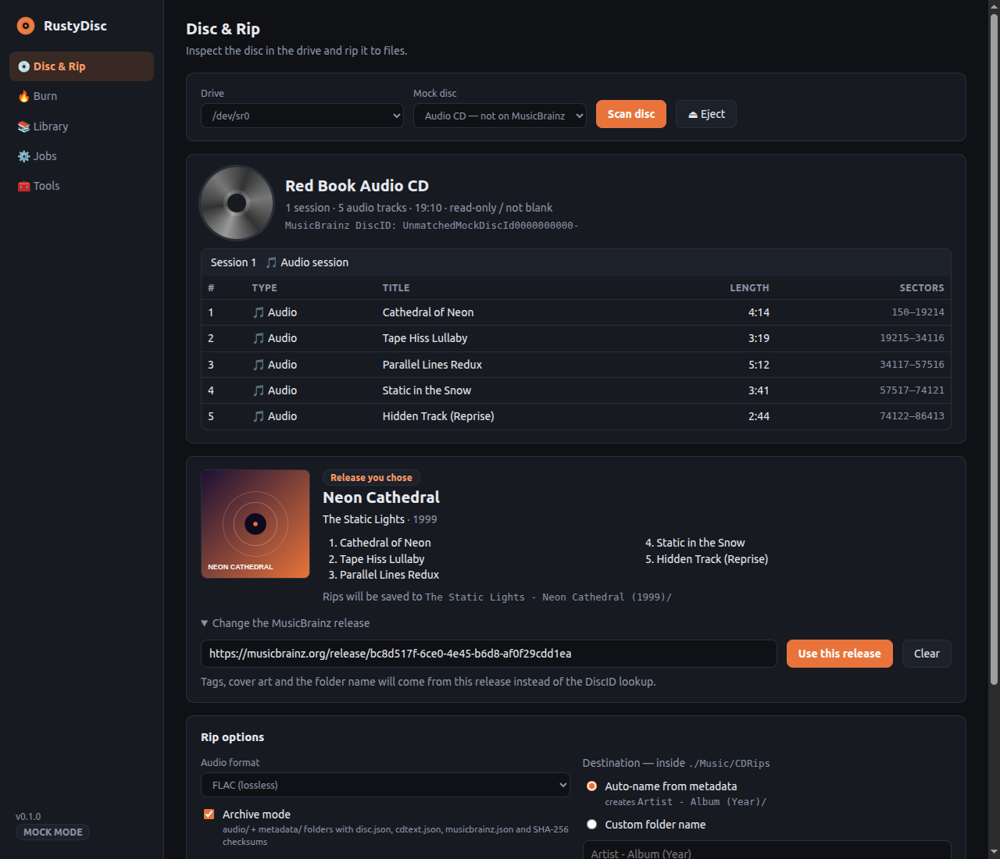
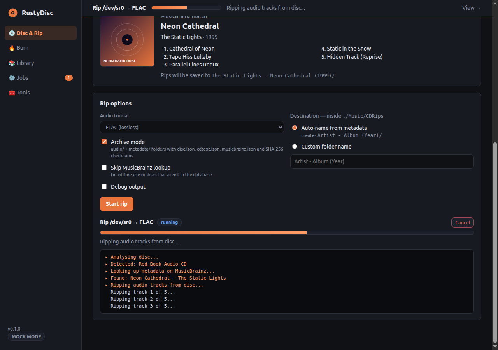
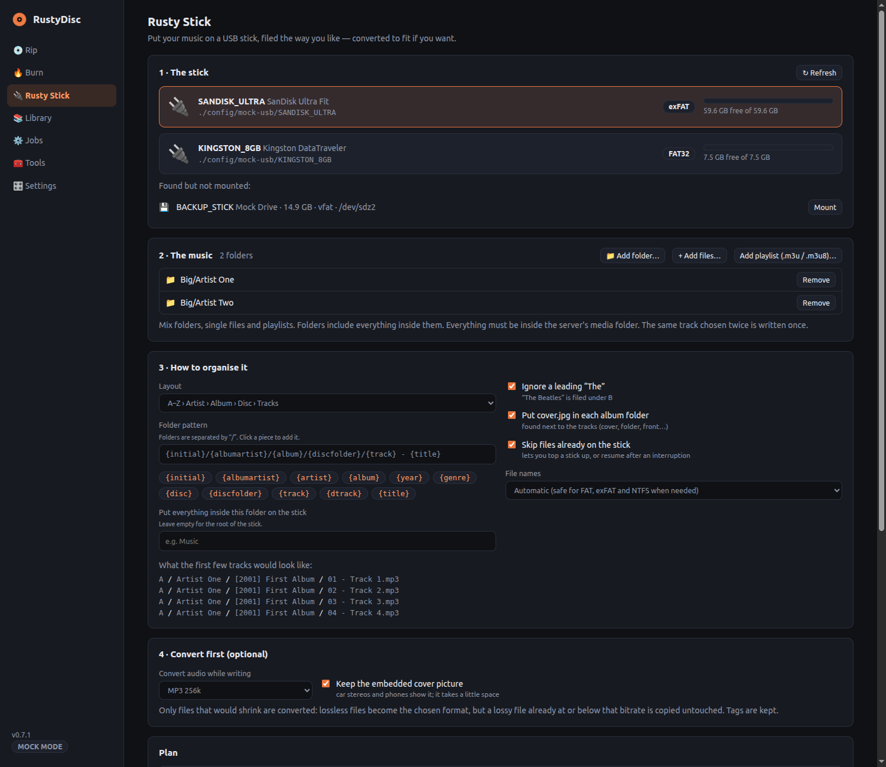
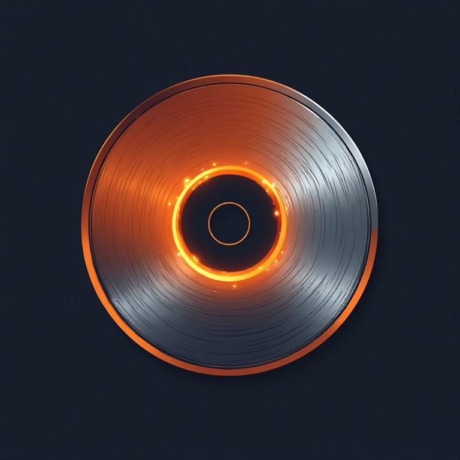

<p align="center">
  
</p>

<p align="center">
  <em>An optical disc toolkit for Linux — burn, rip, archive, and verify<br>Audio CDs, Data CDs, and Blue Book / CD Extra enhanced discs.<br>Use it from the command line, or from a web UI on a headless server.</em>
</p>

<p align="center">
  
  
  
</p>

<p align="center">
  
</p>

<p align="center"><sub>Screenshots in this README use RustyDisc's built-in <code>--mock</code> mode, which simulates a drive so the UI can be shown without hardware.</sub></p>

---

## Why RustyDisc?

Most Linux disc software is either a desktop GUI you have to sit in front of (K3b, Brasero), or a set of single-purpose command-line tools you have to stitch together yourself (`cdparanoia` + `cdrdao` + `xorriso` + `ffmpeg` + a tagger). RustyDisc puts one consistent interface over the tools that already do the hard work:

- **One tool for both directions.** Rip *and* burn, audio *and* data, including Blue Book / CD Extra enhanced discs. It handles the multi-session rules (audio first, data appended, then finalise) for you.
- **Runs where the drive is.** `rustydisc serve` gives you a web UI, so a headless box or Proxmox host with a drive in it can be driven from any browser on your network. There is a Docker image and a compose file.
- **Safe by design.** Every burn is compiled into a plan and validated **before** the drive is touched, so mistakes fail early rather than after wasting a disc. `--dry-run` and *Show plan* let you see exactly what will happen.
- **Rips you can trust later.** Automatic MusicBrainz tags, embedded cover art, an **AccurateRip check** that tells you whether each track matches other people's rips, and an **archive mode** that stores the disc's structure, CD-Text, metadata and SHA-256 checksums so a rip can be re-verified years from now.
- **Scriptable.** Errors are structured JSON with a machine-readable code, and long jobs emit newline-delimited JSON progress. Automation and frontends can build on it without scraping text.

### How it compares

| | **RustyDisc** | K3b | Brasero | abcde | whipper |
|---|:---:|:---:|:---:|:---:|:---:|
| Rip audio CDs (paranoia error correction) | ✅ | ✅ | — | ✅ | ✅ |
| Burn audio CDs | ✅ | ✅ | ✅ | — | — |
| Burn data CDs | ✅ | ✅ | ✅ | — | — |
| Blue Book / CD Extra (audio + data sessions) | ✅ | mixed-mode | — | — | — |
| Rip data sessions and enhanced discs | ✅ | ISO image | ISO image | — | — |
| MusicBrainz tags + cover art | ✅ | CDDB | — | ✅ | ✅ |
| Archive mode with checksums | ✅ | — | — | — | rip log |
| Web UI, usable from another machine | ✅ | — | — | — | — |
| Runs headless / in Docker | ✅ | — | — | ✅ | ✅ |
| Structured JSON errors and progress | ✅ | — | — | — | — |
| Dry-run / plan before writing | ✅ | — | — | — | — |
| AccurateRip verification (v1 + v2) | ✅ | — | — | — | ✅ |
| Desktop GUI | — (web) | ✅ | ✅ | — | — |

<sub>Based on my understanding of each project's documented behaviour; corrections are welcome as issues or PRs. RustyDisc's AccurateRip check is new and read-only: it reports whether each track matches the database, and reports the drive offset it detects, but does not yet correct the ripped audio for that offset the way whipper and EAC do. RustyDisc is Linux-only and, like the tools above, relies on external programs (`cdparanoia`, `cdrdao`, `xorriso`, `ffmpeg`) that the Docker image bundles for you.</sub>

---

## Contents

- [Overview](#overview)
- [Features](#features)
- [Web UI & Docker](#web-ui--docker)
- [Rusty Stick (USB sticks)](#rusty-stick-usb-sticks)
- [System Requirements](#system-requirements)
- [Installation](#installation)
- [Quick Start](#quick-start)
- [Disc Formats](#disc-formats)
- [Commands](#commands)
  - [info](#rustydisc-info)
  - [burn](#rustydisc-burn)
  - [rip](#rustydisc-rip)
  - [verify](#rustydisc-verify)
  - [plan](#rustydisc-plan)
  - [validate](#rustydisc-validate)
  - [recover](#rustydisc-recover)
- [Usage Examples](#usage-examples)
  - [Inspecting a Disc](#inspecting-a-disc)
  - [Ripping Audio CDs](#ripping-audio-cds)
  - [Ripping Data CDs](#ripping-data-cds)
  - [Ripping Blue Book / CD Extra](#ripping-blue-book--cd-extra)
  - [Archive Mode](#archive-mode)
  - [Verifying an Archive](#verifying-an-archive)
  - [Red Book Audio CDs](#red-book-audio-cds)
  - [Data CDs](#data-cds)
  - [Blue Book / CD Extra](#blue-book--cd-extra)
  - [Playlists (M3U/M3U8)](#playlists-m3um3u8)
  - [Transcoding with FFmpeg](#transcoding-with-ffmpeg)
  - [Multi-Disc Burning](#multi-disc-burning)
  - [CD-Text from Tags](#cd-text-from-tags)
  - [CD-RW Operations](#cd-rw-operations)
- [Disc Graph JSON](#disc-graph-json)
- [Error Handling](#error-handling)
- [Hardware Notes](#hardware-notes)
- [Development](#development)
- [License](#license)

---

## Overview

Rusty Disc treats optical discs as structured objects, not just files. The core abstraction is the **DiscGraph** — a unified intermediate representation that drives both directions of the pipeline:

```
          DiscGraph
         /         \
   Burn Plan     Rip Plan
        ↓             ↑
   Physical Disc ↔ Physical Disc
```

Burning and ripping are inverse operations of the same graph. You describe what you want (tracks, files, format, label), RustyDisc figures out the rest.

**Burn pipeline:**
```
CLI flags / JSON graph
        │
        ▼
  Disc Intent Parser      ← validates input, resolves playlists, reads tags
        │
        ▼
   Disc Graph Builder     ← unified intermediate representation
        │
        ▼
   Session Planner        ← enforces Red/Blue Book rules, checks WAV specs
        │
        ▼
 Backend Execution Layer  ← cdrdao (audio), xorriso (data/ISO), ffmpeg (transcode)
        │
        ▼
  Hardware Device Layer   ← ATIP detection, buffer underrun guard, multi-session
```

**Rip pipeline:**
```
Physical Disc
        │
        ▼
  Disc Analyzer           ← reads TOC via cdrecord, detects format, extracts CD-Text
        │                    computes MusicBrainz DiscID from audio track layout
        ▼
  MusicBrainz Lookup      ← queries MB REST API by DiscID; fetches album, artist,
        │                    year, per-track titles, recording IDs
        ▼
  Cover Art Archive       ← downloads front cover image; saved as cover.jpg/png
        │
        ▼
  Secure Rip Engine       ← cdparanoia (paranoia mode: overlapping reads, jitter correction,
        │                    paranoia retry logic)
        ▼
  AccurateRip Check       ← v1 + v2 checksums per track, matched against the database
        │                    (tolerates drive read offset)
        ▼
   Audio Encoders         ← ffmpeg → WAV / FLAC / ALAC / AIFF / OGG / MP3 / Opus
   Data Extractor         ← xorriso → directory tree or ISO image
        │                    cover art embedded in every audio file
        ▼
  Metadata + Checksums    ← musicbrainz.json, accuraterip.json, cdtext.json, disc.json, checksums.json
```

Format constraints are enforced **before** any hardware is touched, so you get a clear error rather than a half-burned coaster.

---

## Features

### Burning
- **Five disc formats** — Red Book Audio, ISO9660 Data CD, Blue Book/CD Extra enhanced CD, **Data DVD** (also Blu-ray sizes) and **Enhanced Music DVD** (music that plays in any DVD player, plus a data folder on the same disc)
- **Playlist support** — burn directly from an M3U or M3U8 playlist, durations read from `#EXTINF` tags
- **FFmpeg transcoding** — convert any audio format to MP3, AAC, Opus, FLAC, or WAV before burning; stage and clean up automatically
- **Multi-disc splitting** — automatically detects when content exceeds a single disc and prompts you to swap discs
- **CD-Text from tags** — reads track title, artist, and album from embedded metadata (ID3, Vorbis, etc.) and writes it to the disc lead-in
- **Disc state detection** — uses ATIP to reliably distinguish blank, appendable, and finalized discs
- **CD-RW guard** — blocks multi-session Blue Book burns on rewriteable media
- **Buffer underrun protection detection** — warns if your drive lacks BURN-Proof/SMART-BURN
- **Dry run mode** — `--dry-run` prints the full execution plan as JSON without touching hardware

### Ripping
- **Secure audio extraction** — cdparanoia backend: overlapping reads, jitter correction and paranoia retry logic for accurate extraction from marginal discs
- **Seven audio output formats** — WAV, FLAC (level 8 compression), ALAC, AIFF, OGG Vorbis, MP3 (VBR best), Opus (320 kbps)
- **Automatic disc detection** — `rustydisc info` and `rustydisc rip` auto-detect Red Book, Data CD, and Blue Book without needing to specify the type
- **MusicBrainz metadata** — computes the MusicBrainz DiscID from the TOC and queries the MusicBrainz API to fetch album title, artist, release year, and per-track titles and recording IDs; embedded as tags in every encoded file
- **Cover art** — from [fanart.tv](https://fanart.tv) (with your API key) and/or the [Cover Art Archive](https://coverartarchive.org), in the priority order you choose (e.g. fanart.tv first, Cover Art Archive as the fallback). Save it as `cover.jpg`/`cover.png`, embed it in every audio file, or both
- **Auto-named output folder** — `--dir` creates `Artist - Album (Year)/` automatically from metadata; no need to name it yourself
- **Polite to MusicBrainz** — every API call is spaced to stay under MusicBrainz's 1 request/second limit (concurrent requests queue rather than fail), and 429/503 responses are retried with back-off, honouring `Retry-After`
- **Manual release override** — if the DiscID isn't matched (or matches the wrong edition), pass `--mb-release <id or URL>`, or in the web UI paste it or search MusicBrainz with the built-in **Find…** browser and preview the release first
- **CD-Text fallback** — if the disc is not in MusicBrainz, CD-Text is read via cdrdao and used for tags instead
- **Blue Book session-aware ripping** — extracts audio and data sessions independently into `audio/` and `data/` subdirectories
- **Data session extraction** — xorriso extracts the ISO filesystem as a directory tree; ISO image output also supported
- **Archive mode** — `--archive` produces a complete reconstruction kit: `disc.json`, `cdtext.json`, `musicbrainz.json`, `checksums.json`
- **AccurateRip verification** — every track is checked against the AccurateRip database (v1 and v2 checksums, offset-tolerant) and reported with a confidence score
- **SHA256 verification** — `rustydisc verify` checks every ripped file against its stored checksum

### Web UI
- **Everything the CLI does, in a browser** — scan, rip, burn, verify, recover and blank from `rustydisc serve`
- **Built for headless servers** — drive attached to one machine, UI on any other; official Dockerfile and compose file
- **Live job progress** — streamed to every open browser, with logs, cancel, and a prompt when a multi-disc burn needs the next blank disc
- **Library browser** — cover art grid, in-browser playback, downloads, one-click checksum verification
- **Plan preview** — see the exact execution plan (and validate hand-written disc graphs) before burning
- **Mock mode** — `--mock` simulates a drive for trying or developing the UI without hardware

### General
- **Structured errors** — every error is machine-readable JSON with a code, message, and `recoverable` flag
- **Machine-readable progress** — `--progress-json` emits newline-delimited JSON events for integration with frontends (e.g. TrackBridge)

---

## Web UI & Docker

`rustydisc serve` runs a web interface for everything the CLI does — scan and rip discs, burn Audio / Data / Enhanced CDs, browse and play your rips, verify archives, recover or blank discs — so a headless machine with the drive attached can be driven from any browser on the network.

```bash
rustydisc serve --rips-dir /srv/Music/CDRips --media-dir /srv/burn-sources
# → http://<host>:8080
```

Want to look around first? `rustydisc serve --mock` simulates a drive, with no hardware needed.

### A tour

**Rip** — scan the disc, see every session and track, get the MusicBrainz match and cover art, then rip with the format and options you choose. The rip destination is named from the metadata (`Artist - Album (Year)/`) unless you pick a name.

<p align="center"></p>

**Wrong or missing MusicBrainz match?** Paste a release ID or URL from musicbrainz.org, or hit **Find…** to search MusicBrainz from inside RustyDisc: search by album and/or artist, browse the results (cover, date, country, label, and a ✓ when the track count matches your disc), preview the track list, and pick the release. Its tags, cover art and folder name replace the DiscID lookup.

<p align="center"></p>

<p align="center"></p>

**Live progress** — jobs run on the server and stream their progress to every open browser. Close the tab and come back later; the job keeps going. A banner follows you around the app while the drive is busy. When the rip finishes its AccurateRip check, a per-track result table appears (the simulated rip in this screenshot shows a drive-offset match).

<p align="center"></p>

**Burn** — build an Audio CD, Data CD, Enhanced (Blue Book) CD, **Data DVD** or **Enhanced Music DVD** from files in the server's media folder. **Show plan** works out how many discs the job needs, and how full each will be, counting the size after any transcoding. Add individual files, a whole folder, or an `.m3u`/`.m3u8` playlist (previewed before you burn, with any skipped entries listed); reorder tracks, set CD-Text, transcode audio in a Data CD, and preview the execution plan before anything is written. Prefer to hand-write it? Paste a disc graph JSON and validate it.

<p align="center"></p>

**Rusty Stick** — put music on a USB stick, organised your way (A–Z › artist › album › disc › tracks, or any pattern), converted to fit, with a plan that says how full the stick will be. See [Rusty Stick](#rusty-stick-usb-sticks).

**Library** — every rip in one place, with cover art, format badges and archive status.

<p align="center"></p>

**Play, download and verify** — play tracks in the browser, download files, see each album's stored AccurateRip result, and re-check an archive against its SHA-256 checksums with one click.

<p align="center"></p>

**Jobs** — a history of everything that ran, with full logs and cancel support.

<p align="center"></p>

**Settings** — tune how RustyDisc behaves, and keep it across restarts. Choose where cover art comes from and in what order (fanart.tv with your API key, the Cover Art Archive, or both with one as the fallback), whether to save `cover.jpg`/`cover.png`, embed the art in each file, or both, and set the defaults for the Rip page.

<p align="center"></p>

The **Tools** page covers disc recovery and CD-RW blanking, and checks that the external programs RustyDisc relies on are installed.

| Flag | Env var | Default | |
|---|---|---|---|
| `--bind` | `RUSTYDISC_BIND` | `0.0.0.0:8080` | listen address |
| `--device` | `RUSTYDISC_DEVICE` | `/dev/sr0` | default drive |
| `--rips-dir` | `RUSTYDISC_RIPS_DIR` | `./rips` | rip output + library |
| `--media-dir` | `RUSTYDISC_MEDIA_DIR` | `./media` | burn sources |
| `--config-dir` | `RUSTYDISC_CONFIG_DIR` | `./config` | where settings are stored |
| `--mock` | `RUSTYDISC_MOCK` | off | simulate a drive (no hardware needed) |

There is **no authentication** — run it on a trusted network or behind a reverse proxy. Only one job may use the drive at a time; long jobs stream live progress to every open browser.

### Docker

```bash
docker compose up -d --build     # http://<host>:8080
```

The image bundles everything RustyDisc needs (`cdparanoia`, `cdrdao`, `xorriso`, `wodim`, `ffmpeg`, `eject`). `docker-compose.yml` passes `/dev/sr0` (and `/dev/sg0`, needed for burning) into the container, adds the `SYS_RAWIO` capability, and mounts `./rips` (your output), `./media` (burn sources, read-only) and `./config` (your settings, including the fanart.tv key). Edit the device names and volume paths to match your machine.

**Prebuilt image:** `wb20244/rustydisc` on Docker Hub. [`compose.dockge.yaml`](compose.dockge.yaml) is a ready-to-paste stack for Dockge (or any Compose host) that uses it instead of building.

**On Proxmox:** Docker usually runs inside a VM or LXC, so pass the drive into that guest first. For a VM, use SATA or USB passthrough; for an LXC, allow and bind the `/dev/sr0` and `/dev/sg*` device nodes.

**Security:** the UI has no login. Keep it on a trusted network, or put it behind a reverse proxy that adds authentication.

---

## Rusty Stick (USB sticks)

Rusty Stick puts a music collection on a USB stick, **filed the way you want it**, converted first if you like, and only if it will fit. It is in the web UI (sidebar: **Rusty Stick**) and on the command line (`rustydisc stick`).

<p align="center"></p>

1. **Pick the stick.** Every mounted USB stick is listed with its size, free space and filesystem. Only USB and removable devices are offered, so your big data disks can't be chosen by mistake.
2. **Pick the music:** any mix of folders, individual files and `.m3u`/`.m3u8` playlists. The same track chosen twice is written once.
3. **Pick the layout.** Choose a preset or write your own pattern from the tokens below, with a live preview of what your first tracks will look like:

| Preset | Result |
|---|---|
| A–Z › Artist › Album › Disc › Tracks | `B/Beatles/Abbey Road/01 - Come Together.mp3` |
| Artist › Album › Disc › Tracks | `Beatles/Abbey Road/01 - Come Together.mp3` |
| Artist › Album › Tracks (disc in the track number) | `Beatles/White Album/2-05 - Song.mp3` |
| Artist › Year - Album › Tracks | `Beatles/1969 - Abbey Road/01 - Come Together.mp3` |
| Artist - Album › Tracks | `Beatles - Abbey Road/01 - Come Together.mp3` |
| One folder | `Beatles - Come Together.mp3` |

Tokens: `{initial}` `{albumartist}` `{artist}` `{album}` `{year}` `{genre}` `{disc}` `{discfolder}` `{track}` `{dtrack}` `{title}`. `{discfolder}` is "Disc 2" only for albums that really have several discs, so single-disc albums don't get a pointless `Disc 1` folder. `{dtrack}` puts the disc in the track number (`2-05`) for multi-disc albums. Tags are used where present; otherwise names are guessed from the folders (`Artist/Album/CD 2/03 - Song.flac`).

4. **Convert first (optional)**, the same way as for discs: only files that would shrink are converted, tags are kept, and the embedded cover picture can be kept too (car stereos and phones show it).
5. **See the plan.** It says how many files, how big they'll be after conversion, and how full the stick will be. If it doesn't fit, one click applies a size that does (MP3 320 / 256 / 192 / 160 / 128, Opus 96). It counts what files really take on the stick (whole clusters and directory entries) and leaves a safety margin.
6. **Write.** Files are written in sorted order (many car stereos and players play a folder in the order the files were written, not alphabetically), each to a temporary name and renamed when complete, then flushed with `sync`. Afterwards you can eject the stick from the page.

Quality-of-life details: cover art is copied into each album folder (`cover.jpg`); files already on the stick are skipped, so you can top a stick up or resume after an interruption; names are made safe for FAT, exFAT and NTFS automatically (`: * ? " < > |`, trailing dots, reserved names); files over FAT32's 4 GB limit are flagged; "The Beatles" is filed under B (switchable); you can write into a subfolder such as `Music`; a dry run works everything out without writing; and "empty the stick first" needs you to type the folder's name.

<p align="center"></p>

```bash
# See the plan (JSON): a music folder and a playlist, converted to MP3 256k
rustydisc stick --target /run/media/you/STICK --folder ~/Music --playlist "Road Trip.m3u8" \
  --preset initial-artist-album --transcode mp3:256 --plan

# Write it
rustydisc stick --target /run/media/you/STICK --folder ~/Music --transcode mp3:256 \
  --layout "{albumartist}/{year} - {album}/{discfolder}/{track} - {title}" --subfolder Music
```

| Flag | Description |
|---|---|
| `--target <dir>` | The stick's mount point |
| `--folder`, `--file`, `--playlist` | Sources; repeat any of them |
| `--preset <id>` / `--layout <pattern>` | `initial-artist-album`, `artist-album` (default), `artist-album-flat`, `artist-year-album`, `artist-album-onefolder`, `flat` — or your own pattern |
| `--transcode <spec>` | e.g. `mp3:256`, `aac:256`, `opus:128`, `flac` |
| `--subfolder <name>` | Write into this folder instead of the root |
| `--no-covers`, `--no-keep-art`, `--no-skip-existing` | Turn the extras off |
| `--windows-names auto\|on\|off` | File-name rules (auto looks at the stick's filesystem) |
| `--keep-the` | File "The Beatles" under T |
| `--clear --confirm-clear <name>` | Empty the destination first (the name must match) |
| `--plan`, `--dry-run`, `--force` | Show the plan / write nothing / write even if it won't fit |

### Making sticks visible to RustyDisc

The stick has to be **mounted** where RustyDisc runs.

- **Desktop / normal install:** nothing to do; sticks are mounted for you (under `/run/media/<you>` or `/media/<you>`) and listed automatically. Unmounted sticks show a **Mount** button (it uses `udisksctl`).
- **Docker on a headless server:** either
  - mount the stick on the host and share a folder with the container: add `- /mnt/usb:/usb:rslave` to the volumes and set `RUSTYDISC_STICK_DIRS: /usb` (sticks mounted inside `/usb` are listed; you can also list folders under **Settings → Rusty Stick**), or
  - let RustyDisc mount sticks itself, hot-plug style, by giving the container `cap_add: [SYS_ADMIN, MKNOD]` and `device_cgroup_rules: ["b 8:* rwm"]`. Unmounted sticks then get a **Mount** button.
  See the commented lines in `docker-compose.yml`. These capabilities are powerful, so use them only on a network you trust (the web UI has no login).
- **Anywhere else** (a network share, an SD card reader, a folder you just want to fill): list its absolute path under **Settings → Rusty Stick**.

Notes: this has been tested against folders and simulated sticks, not yet against a range of real USB sticks. FAT32 sticks work but are the fussiest (4 GB file limit, slow with many tiny files); exFAT and ext4 are better for big libraries.

---

## System Requirements

### Runtime dependencies

| Tool | Purpose | Required for |
|------|---------|-------------|
| `cdrdao` | Red Book audio DAO burning; CD-Text reading | Burn (audio), Rip |
| `xorriso` | ISO9660 generation, data burns, data extraction | Burn (data), Rip |
| `cdrecord` / `wodim` | TOC reading, disc state detection | Burn, Rip |
| `isoinfo` | Data session metadata (volume label, size) | Rip |
| `genisoimage` | Builds the UDF disc images for DVDs | Burn (DVD) |
| `dvdauthor` | Builds the DVD-Video structure of a Music DVD | Burn (Music DVD) |
| `cdparanoia` | Secure audio ripping | Rip (audio) |
| `ffmpeg` | Audio transcoding, encoding, cover art embedding | Burn (transcode), Rip (encode) |

### Install on Debian / Ubuntu

```bash
# Burning
sudo apt install cdrdao xorriso cdrecord

# Ripping
sudo apt install cdparanoia ffmpeg

# All at once
sudo apt install cdrdao xorriso cdrecord cdparanoia ffmpeg genisoimage dvdauthor
```

### Install on Arch Linux

```bash
sudo pacman -S cdrtools cdrdao xorriso cdparanoia ffmpeg
```

### Install on Fedora

```bash
sudo dnf install cdrtools cdrdao xorriso cdparanoia ffmpeg
```

### Rust toolchain

Requires **Rust 1.85 or newer**. Install via [rustup](https://rustup.rs):

```bash
curl --proto '=https' --tlsv1.2 -sSf https://sh.rustup.rs | sh
```

---

## Installation

### From source (recommended)

```bash
git clone https://github.com/WB2024/DiscCTL.git
cd DiscCTL
cargo build --release
sudo install -m755 target/release/rustydisc /usr/local/bin/
```

### Local user install (no sudo)

```bash
cargo install --path .
# binary lands at ~/.cargo/bin/rustydisc
```

### Verify

```bash
rustydisc --version
rustydisc --help
```

---

## Quick Start

```bash
# What's on the disc?
rustydisc info

# Rip a disc to FLAC — folder named automatically from MusicBrainz metadata
rustydisc rip --format flac --dir ~/rips

# Rip with full archive (checksums, metadata, disc graph, MusicBrainz JSON)
rustydisc rip --format flac --dir ~/rips --archive

# Burn a set of WAV files as a Red Book audio CD
rustydisc burn --format redbook --audio ~/music/album/*.wav --label "My Album"

# Burn a directory as a data CD
rustydisc burn --format datacd --data ~/files/backup --label "Backup 2026"

# Burn from a playlist
rustydisc burn --format redbook --playlist "Smooch Hits.m3u8" --label "Smooch Hits"

# Preview a burn plan without touching the drive
rustydisc plan --format redbook --audio ~/music/album/*.wav --label "My Album"
```

---

## Disc Formats

<p align="center">
  
</p>

### Red Book (`--format redbook`)

The standard audio CD format (IEC 60908). Supports up to **99 tracks** and **74 minutes** of 44.1 kHz 16-bit stereo PCM audio. Written in Disc-At-Once (DAO) mode via `cdrdao`. CD-Text is stored in the R-W subchannels of the lead-in area.

Audio files must be **44.1 kHz, 16-bit stereo WAV** (CDDA spec). Non-compliant files are rejected at plan time. Use `--transcode wav` to convert first.

### Data CD (`--format datacd`)

A single-session ISO9660 data disc with Joliet and Rock Ridge extensions. Supports up to **700 MB** of content. Built and burned with `xorriso`. Volume label is written as uppercase ISO9660 (max 32 characters).

### Data DVD (`--format datadvd`)

Like a Data CD, but on a DVD (or Blu-ray): files, a folder or a playlist, with the same multi-disc splitting and transcoding. The image is ISO 9660 + Joliet + Rock Ridge + **UDF**, so files over 4 GB and long names work. Choose the blank disc with `--disc-size`:

| `--disc-size` | Disc | Capacity |
|---|---|---|
| `dvd` (default for DVDs) | DVD±R | 4.7 GB (4482 MiB) |
| `dvd-dl` | DVD±R DL | 8.5 GB (8147 MiB) |
| `bd` | BD-R | 25 GB (23866 MiB) |
| `bd-dl` | BD-R DL | 50 GB (47732 MiB) |

Any number of MB also works. A DVD keeps about 16 MB free. The plan counts converted sizes, so 2 GB of FLAC converted to MP3 320k shows as about 1.3 GB and one DVD instead of three CDs.

```bash
rustydisc plan --format datadvd --playlist "Magnum Opus.m3u8" --transcode mp3:320
rustydisc burn --format datadvd --playlist "Magnum Opus.m3u8" --transcode mp3:320 --label "Magnum Opus"
```

<p align="center"></p>

### Enhanced Music DVD (`--format musicdvd`)

The DVD counterpart of an Enhanced CD: **music that plays in any DVD player, with a data folder on the same disc.** There is no Red Book audio on a DVD, so the music is authored as a **DVD-Video** disc:

- every track is a **chapter** (next/previous work, and the disc starts playing as soon as it is inserted), shown over a still picture: the cover art next to the tracks, an image you choose (`--dvd-still`), or a plain background;
- the audio is **Dolby Digital (AC-3) stereo** at 192, 256, 384 or 448 kbps (`--dvd-audio-kbps`, default 448) — lossy, but universally supported;
- the picture standard is **PAL** (default) or **NTSC** (`--dvd-standard`);
- an optional **data folder** (`--data`) goes in the root of the disc next to `VIDEO_TS`, so the same disc is a data DVD in a computer;
- more than 99 tracks become several titles that play one after another (DVD-Video allows 99 chapters per title).

Everything has to fit on **one** disc, and the plan tells you how full it is. As a guide, a track takes about 5 MB per minute at 448 kbps (including the picture), so a 4.7 GB DVD holds roughly 15 hours of music.

```bash
rustydisc burn --format musicdvd --playlist "Album.m3u8" --data ~/Bonus --label "My Album" --dvd-standard pal
```

<p align="center"></p>

Notes:

- **Lossless audio is not offered** — DVD-Video allows uncompressed LPCM, but the tools that author it produced non-standard streams in testing, so only Dolby Digital is available for now. DVD-Audio (`AUDIO_TS`) discs are not supported.
- The disc structure is verified against the DVD-Video layout (chapters, PAL/NTSC, AC-3, files in the image), but as with all burn features, check it on your own player and drive. The disc must be blank; a used DVD-RW has to be erased first.
- **`--iso-out disc.iso`** builds the finished disc image into a file instead of burning it (for DVD formats). Handy to inspect the result, test in a media player, or burn later with another tool.

### Blue Book / CD Extra (`--format bluebook`)

An enhanced CD with **two sessions**: Session 1 is a Red Book audio session (left open), Session 2 is appended as an ISO9660 data session, then the disc is finalized. Audio tracks play on any CD player; the data session is visible when inserted in a computer.

Session ordering (Audio → Data) is enforced at plan time. Blue Book requires a CD-R; CD-RW does not support the required multisession append.

---

## Commands

### `rustydisc info`

Reads the disc in the drive and reports its format, session layout, track list, durations, data session sizes, CD-Text, and MusicBrainz DiscID — without modifying anything.

```bash
rustydisc info
rustydisc info --device /dev/sr1
rustydisc info --json
```

| Flag | Description |
|------|-------------|
| `--device <dev>` | Drive to inspect (default: `/dev/sr0`) |
| `--json` | Output raw JSON (DiscInfo struct) instead of formatted text |

**Example output:**
```
Disc Type:  Red Book Audio CD
Sessions:   1
DiscID:     8yJcG2R53kN7I374FYHtRiMpPes-

Session 1 — Audio  (20 tracks, 65:02)  «Bona Drag» — Morrissey
  Track  1   3:47  "Piccadilly Palare"
  Track  2   3:19  "Interesting Drug"
  ...
```

---

### `rustydisc burn`

Burns a disc from command-line flags or a JSON disc graph.

```
rustydisc burn [OPTIONS]
```

#### Input flags

| Flag | Description |
|------|-------------|
| `--format <fmt>` | Disc format: `redbook`, `datacd`, `bluebook`, `datadvd`, `musicdvd` (default: `redbook`) |
| `--audio <files...>` | Audio track files or glob patterns (WAV/FLAC/MP3/M4A/OGG etc.) |
| `--playlist <file>` | M3U or M3U8 playlist of audio tracks (Audio / Enhanced CD) or files (Data CD) |
| `--data <dir>` | Data CD: the folder to burn (sub-folders are kept). Enhanced CD: the folder for the data session |
| `--files <files...>` | Data CD only: individual files, placed in the root of the disc |
| `--label <text>` | Disc volume label (default: `Untitled`) |
| `--input <file>` | Load a disc graph JSON instead of building from flags |

#### Behaviour flags

| Flag | Description |
|------|-------------|
| `--device <dev>` | Target drive device (default: `/dev/sr0`) |
| `--dry-run` | Print the burn plan as JSON — do not burn |
| `--debug` | Print backend commands and verbose output |
| `--cd-text` | Read CD-Text (title, artist) from embedded audio file tags |
| `--progress-json` | Emit machine-readable JSON progress events to stdout |

#### Transcoding flags

| Flag | Description |
|------|-------------|
| `--transcode <spec>` | Data CD: convert audio before burning: `mp3:256`, `aac:320`, `opus:192`, `flac`, `wav` (only files that would shrink are converted) |
| `--disc-size <size>` | Blank disc: a size in MB or a name — `cd650`, `cd700` (default for CDs), `cd800`, `dvd` (default for DVDs), `dvd-dl`, `bd`, `bd-dl` |
| `--dvd-audio-kbps <n>` | Music DVD: Dolby Digital bitrate: 192, 256, 384 or 448 (default) |
| `--dvd-standard <pal\|ntsc>` | Music DVD: picture standard (default `pal`) |
| `--dvd-still <image>` | Music DVD: picture shown while the music plays (default: cover art beside the tracks) |
| `--iso-out <file>` | DVD formats: save the disc image to a file instead of burning |
| `--stage-dir <dir>` | Where to write converted files, one disc at a time (default: `/tmp`) |
| `--keep-staged` | Keep staged files after burn (default: delete on exit) |

---

### `rustydisc rip`

Rips the disc in the drive to files. Auto-detects the disc format and handles Red Book audio, Data CD, and Blue Book appropriately.

After detecting the disc, RustyDisc automatically:
1. Computes the **MusicBrainz DiscID** from the TOC
2. Queries the **MusicBrainz API** for album title, artist, year, and track titles
3. Downloads **cover art** from the Cover Art Archive
4. Rips audio securely with **cdparanoia**
5. Checks each track against the **AccurateRip** database
6. Encodes to the requested format and **embeds all metadata and cover art** into each file

```
rustydisc rip [OPTIONS]
```

| Flag | Description |
|------|-------------|
| `--device <dev>` | Drive to rip from (default: `/dev/sr0`) |
| `--dir <base-dir>` | **Recommended.** Base directory — a subfolder named `Artist - Album (Year)` is auto-created from metadata |
| `--output <dir>` | Explicit output path — use this exact directory name |
| `--format <fmt>` | Audio format: `wav`, `flac`, `alac`, `aiff`, `ogg`, `mp3`, `opus` (default: `flac`) |
| `--archive` | Archive mode: store in `audio/` + `metadata/` subdirs; add `musicbrainz.json` + `checksums.json` |
| `--mb-release <id\|url>` | Use this MusicBrainz release for tags, cover art and folder name instead of the DiscID lookup — see [Choosing the MusicBrainz release](#choosing-the-musicbrainz-release) |
| `--no-musicbrainz` | Skip MusicBrainz lookup (for offline use or discs not in the database) |
| `--cover-sources <list>` | Where to get cover art, best first: `fanart`, `caa` (Cover Art Archive). Default `caa`, e.g. `fanart,caa` |
| `--fanart-key <key>` | fanart.tv API key for the `fanart` source (or set `RUSTYDISC_FANART_KEY`, which keeps it off the command line) |
| `--no-cover-file` | Don't save `cover.jpg` / `cover.png` next to the tracks |
| `--no-cover-embed` | Don't embed the cover art in the audio files |
| `--no-accuraterip` | Skip the AccurateRip database check (for offline use) |
| `--debug` | Verbose output including MusicBrainz and AccurateRip URLs, ffmpeg commands |
| `--progress-json` | Emit machine-readable JSON progress events to stdout |

**Audio formats:**

| Format | Type | Notes |
|--------|------|-------|
| `wav` | Lossless | Raw CDDA PCM — no encoding step, fastest |
| `flac` | Lossless | FLAC compression level 8 — recommended |
| `alac` | Lossless | Apple Lossless, `.m4a` container |
| `aiff` | Lossless | Big-endian PCM, archival format |
| `ogg` | Lossy | OGG Vorbis quality 10 (~500 kbps) |
| `mp3` | Lossy | LAME VBR quality 0 (highest) |
| `opus` | Lossy | Opus 320 kbps |

**Default output layout (flat):**
```
Artist - Album (Year)/
  cover.jpg                                       ← front cover from Cover Art Archive
  01. Artist - Album - Track Title.flac
  02. Artist - Album - Track Title.flac
  ...
```

**Archive output layout (`--archive`):**
```
Artist - Album (Year)/
  cover.jpg
  audio/
    01. Artist - Album - Track Title.flac
    ...
  metadata/
    disc.json           ← full TOC, session layout, track LBAs, DiscID
    cdtext.json         ← CD-Text in structured JSON (if present on disc)
    musicbrainz.json    ← full MusicBrainz release data (if found)
    accuraterip.json    ← per-track AccurateRip result (if the disc is in the database)
    checksums.json      ← SHA256 + byte count per file
```

#### Cover art sources

```bash
# fanart.tv first, Cover Art Archive as the fallback; embed only (no cover.jpg left behind)
RUSTYDISC_FANART_KEY=your-key rustydisc rip --dir ~/rips --cover-sources fanart,caa --no-cover-file
```

Sources are tried in the order given and the first one with an image wins. fanart.tv needs a free personal API key ([get one here](https://fanart.tv/get-an-api-key/)) and finds albums by their MusicBrainz release group, so it works when the disc was matched (or chosen) on MusicBrainz. If the key is missing or rejected, that source is skipped and the next one is used. Embedding is supported for FLAC, MP3, ALAC and OGG; AIFF, Opus and WAV files can't carry embedded art, so use the cover file for those.

**Metadata priority:** MusicBrainz > CD-Text > auto-generated defaults.

#### Choosing the MusicBrainz release

Discs are matched by DiscID, but plenty of pressings aren't attached to their MusicBrainz release yet (and some DiscIDs match the wrong edition). When that happens, look the release up on musicbrainz.org yourself and hand RustyDisc its ID or URL:

```bash
rustydisc rip --dir ~/rips --mb-release https://musicbrainz.org/release/bc8d517f-6ce0-4e45-b6d8-af0f29cdd1ea
rustydisc rip --dir ~/rips --mb-release bc8d517f-6ce0-4e45-b6d8-af0f29cdd1ea
```

The release's title, artist, year, track titles, MusicBrainz IDs and cover art are used exactly as if the DiscID lookup had found it. For multi-disc releases the matching disc is chosen by DiscID, or by track count. If the release's track count doesn't match the disc you get a warning, and if you named a release that doesn't exist (or a multi-disc release with no matching disc) the rip stops before reading the disc rather than silently falling back. In the web UI, open *Use a MusicBrainz release I've found* on the Rip page, then either paste the ID/URL or click **Find…** to search MusicBrainz and browse the candidates before ripping.

**Cover art embedding** is supported for FLAC, ALAC, MP3, and OGG Vorbis. The cover is also always saved as `cover.jpg` / `cover.png` in the output directory regardless of format.

**MusicBrainz tags embedded per file:**

| Tag field | Content |
|-----------|---------|
| `title` | Track title |
| `artist` | Track artist (or album artist if same for all tracks) |
| `album` | Album title |
| `album_artist` | Album artist |
| `date` | Release year |
| `track` | Track number / total |
| `MUSICBRAINZ_TRACKID` | MB recording ID |
| `MUSICBRAINZ_ALBUMID` | MB release ID |
| `MUSICBRAINZ_ARTISTID` | MB artist ID |

---

### `rustydisc verify`

Verifies a ripped archive against its `checksums.json`. Checks every file's SHA256 hash and byte count.

```bash
rustydisc verify ~/rips/my_album
```

| Argument | Description |
|----------|-------------|
| `<directory>` | Root directory of the ripped archive (must contain `metadata/checksums.json`) |

**Example output:**
```
Verifying archive: /home/user/rips/my_album
Passed: 12
OK — all 12 files verified.
```

```
Verifying archive: /home/user/rips/my_album
FAILED (1):
  ✗  audio/03 - Track Title.flac
Passed: 11
```

Exit code `0` on success, `1` on failure (with structured JSON error on stderr).

---

### `rustydisc plan`

Prints the burn plan as JSON without writing to any device: how many discs are needed, what goes on each and how full it is (counting the converted size when `--transcode` is given), plus the burn steps for a single disc. Useful for scripting and verifying disc layout before committing to media. It accepts the same source flags as `burn` (`--audio`, `--playlist`, `--data`, `--files`, `--transcode`, `--disc-size`).

```
rustydisc plan --format redbook --audio ~/music/*.wav --label "Preview"
rustydisc plan --format datacd --data ~/Music --transcode mp3:320 --disc-size 700
rustydisc plan --input disc.json
```

---

### `rustydisc validate`

Validates a disc graph JSON file for correctness — format rules, WAV spec, ISO size, session ordering — without touching hardware.

```
rustydisc validate disc.json
```

Returns exit code `0` on success, `1` on validation failure (with a structured JSON error on stderr).

---

### `rustydisc recover`

Inspects the disc in the drive and attempts to recover from an interrupted burn.

```
rustydisc recover --device /dev/sr0
rustydisc recover --device /dev/sr0 --blank fast
rustydisc recover --device /dev/sr0 --blank full
```

| Flag | Description |
|------|-------------|
| `--device <dev>` | Target drive (default: `/dev/sr0`) |
| `--blank <mode>` | Blank a CD-RW: `fast` (quick erase) or `full` (complete erase) |

---

## Usage Examples

### Inspecting a Disc

```bash
# Human-readable summary (shows DiscID, CD-Text, session layout)
rustydisc info

# JSON output (for scripting)
rustydisc info --json | jq '.discid'
rustydisc info --json | jq '.sessions[0].tracks | length'
```

---

### Ripping Audio CDs

The simplest command — folder is named automatically from MusicBrainz:

```bash
rustydisc rip --format flac --dir ~/rips
# creates: ~/rips/Morrissey - Bona Drag (2010)/
#          cover.jpg + 20 FLAC files, all tagged and cover-embedded
```

Other formats:

```bash
# WAV (fastest — no encoding step)
rustydisc rip --format wav --dir ~/rips

# MP3
rustydisc rip --format mp3 --dir ~/rips

# ALAC (Apple ecosystem)
rustydisc rip --format alac --dir ~/rips

# Explicit output path (skip auto-naming)
rustydisc rip --format flac --output ~/rips/Morrissey\ -\ Bona\ Drag\ \(2010\)

# Offline — skip MusicBrainz, use CD-Text only
rustydisc rip --format flac --dir ~/rips --no-musicbrainz

# Verbose output
rustydisc rip --format flac --dir ~/rips --debug
```

Metadata source priority: **MusicBrainz** (if disc is found) → **CD-Text** (if encoded on disc) → track numbers only.

---

### Ripping Data CDs

```bash
# Extract filesystem as directory tree
rustydisc rip --output ~/rips/data_disc

# With debug output showing xorriso progress
rustydisc rip --output ~/rips/data_disc --debug
```

---

### Ripping Blue Book / CD Extra

Blue Book is handled automatically. Both sessions are detected and extracted:

```bash
rustydisc rip --format flac --dir ~/rips
```

Produces:
```
Artist - Album (Year)/
  cover.jpg
  audio/                  ← Session 1: FLAC files with full metadata + cover embedded
  data/                   ← Session 2: ISO filesystem contents
  metadata/
    disc.json
    cdtext.json
    musicbrainz.json
```

---

### Archive Mode

Archive mode adds checksums and a complete metadata set for long-term preservation:

```bash
rustydisc rip --format flac --dir ~/archive --archive
```

Produces:
```
Morrissey - Bona Drag (2010)/
  cover.jpg
  audio/
    01. Morrissey - Bona Drag - Piccadilly Palare.flac
    02. Morrissey - Bona Drag - Interesting Drug.flac
    ...
  metadata/
    disc.json           ← full DiscInfo: session layout, track LBAs, DiscID
    cdtext.json         ← CD-Text in structured JSON
    musicbrainz.json    ← full MusicBrainz release data
    checksums.json      ← SHA256 + size per file
```

---

### Verifying an Archive

```bash
rustydisc verify ~/archive/Morrissey\ -\ Bona\ Drag\ \(2010\)
```

Verifies every file against the SHA256 checksums recorded at rip time. Useful for long-term storage integrity checks.

---

### Red Book Audio CDs

**Burn a single album from WAV files:**
```bash
rustydisc burn --format redbook \
  --audio ~/music/Loveless/*.wav \
  --label "Loveless"
```

**Burn with CD-Text populated from embedded tags:**
```bash
rustydisc burn --format redbook \
  --audio ~/music/Loveless/*.wav \
  --label "Loveless" \
  --cd-text
```

**Burn from a playlist, dry-run first:**
```bash
rustydisc plan --format redbook --playlist "Mix.m3u8" --label "Mix"
rustydisc burn --format redbook --playlist "Mix.m3u8" --label "Mix"
```

**Convert MP3s to WAV automatically, then burn:**
```bash
rustydisc burn --format redbook \
  --audio ~/music/album/*.mp3 \
  --transcode wav \
  --label "My Album"
```

---

### Data CDs

**Burn a directory:**
```bash
rustydisc burn --format datacd \
  --data /srv/backups/project \
  --label "Project Backup"
```

**Convert all audio to MP3 256kbps CBR, then burn:**
```bash
rustydisc burn --format datacd \
  --data /srv/Media/Music \
  --transcode mp3:256 \
  --label "Music Collection"
```

---

### Blue Book / CD Extra

```bash
rustydisc burn --format bluebook \
  --audio ~/album/tracks/*.wav \
  --data ~/album/extras \
  --label "My Album"
```

The disc will play as a standard audio CD in any player, and show the `extras/` content when inserted into a computer.

---

### Playlists (M3U/M3U8)

Pass any M3U or M3U8 playlist with `--playlist`; it works for Audio CDs, Enhanced CDs and Data CDs.

- **Relative paths** are resolved from the playlist file's own folder (`../Albums/01.flac`, `Album One/01 Track.flac`).
- **Other ways of writing a path** are understood: Windows separators (`Music\Album\01.flac`), `C:\…` drive prefixes, `file://` URIs, `%20`-style escapes, and quoted paths. If a playlist was written on another machine and the absolute path doesn't exist here, RustyDisc looks for the same tail of the path next to the playlist (`C:\Users\me\Music\Album\01.flac` finds `Album/01.flac` beside the playlist).
- **Encodings:** `.m3u8` is UTF-8 (a BOM is fine); plain `.m3u` files that aren't valid UTF-8 are read as Windows-1252/Latin-1. CRLF line endings are fine.
- `#EXTINF` durations are used for multi-disc planning without requiring `ffprobe`.
- Entries that can't be used (missing files, folders, streams) are skipped with a warning naming each one.

For a Data CD, the files from a playlist go in the root of the disc. If two files share a name, the second becomes `name (2).ext` rather than overwriting the first.

```bash
# Data CD from playlist
rustydisc burn --format datacd \
  --playlist "/srv/Media/Playlists/Smooch Hits.m3u8" \
  --label "Smooch Hits"

# Red Book from playlist
rustydisc burn --format redbook \
  --playlist "~/playlists/chill.m3u8" \
  --label "Chill Mix"
```

Streaming URLs (`http://`, `https://`) in the playlist are skipped with a warning.

Data CDs can also be built from individual files with `--files a.txt b.pdf ...`.

---

### Transcoding with FFmpeg

The `--transcode` flag accepts a format name with an optional bitrate:

| Spec | Result |
|------|--------|
| `mp3:256` | MP3 CBR at 256 kbps |
| `mp3:320` | MP3 CBR at 320 kbps |
| `mp3:128` | MP3 CBR at 128 kbps |
| `aac:256` | AAC at 256 kbps |
| `opus:192` | Opus at 192 kbps |
| `flac` | Lossless FLAC (no bitrate) |
| `wav` | PCM WAV — required for Red Book if source is not 44.1/16/stereo |

Transcoded files are staged in a temporary directory, used for the burn, then deleted. Supply `--stage-dir` to control where they land, and `--keep-staged` to retain them.

---

### Multi-Disc Burning

When the content doesn't fit on one disc, RustyDisc works out how many discs are needed and walks you through burning each one. `rustydisc plan` (and **Show plan** in the web UI) shows the whole plan first: how many discs, what goes on each, and how full each will be.

How discs are filled:

- **Data CD** — packed by size, in order (albums and playlists stay together). Every file counts its ISO 9660 overhead (sector padding and directory records), and each disc keeps about 6 MB free, so a "700 MB" disc gets about 693 MB of files. Sub-folders are kept.
- **Transcoding is counted.** If you convert audio first (`--transcode mp3:320`), each file is counted at its *size after converting* (bitrate × length), so 2 GB of FLAC that becomes 1.3 GB of MP3 needs fewer discs. Files are only converted when it helps: lossless files are converted, but a lossy file already at or below the target bitrate is left alone (a 128k MP3 is never "upgraded" to 320k), and non-audio files are never touched. Estimates are slightly conservative.
- **The burn checks the real sizes.** Files are converted one disc at a time; the real converted size decides when a disc is full, and the disc image size is checked against the disc before anything is written. Only one disc's worth of converted files exists at a time (use `--stage-dir` to put them somewhere with more room than `/tmp`).
- **Red Book audio** — packed by playing time (79:30 on an 80-minute disc, up to 99 tracks).
- **Enhanced CD** — everything must fit on one disc, counting the audio, the gap between the two sessions and the data. If it doesn't fit you're told by how much.
- **Disc size** — `--disc-size 700` (default, 80 min), `650` (74 min) or `800` (90 min); it's a drop-down in the web UI.

<p align="center"></p>

```bash
# See the plan first: 3 discs as they are, 2 after converting to MP3 320k
rustydisc plan --format datacd --playlist "Giant Collection.m3u8"
rustydisc plan --format datacd --playlist "Giant Collection.m3u8" --transcode mp3:320

# 150 FLAC tracks → automatically split across multiple discs
rustydisc burn --format redbook \
  --playlist "Giant Collection.m3u8" \
  --label "Giant Collection"
```

**Example output:**
```
110 tracks (6:32:00 total) → 6 discs required.

══ Disc 1 of 6 ═══════════════════════════════════════
  17 tracks  |  73:44
Insert blank disc 1 into /dev/sr0 and press ENTER to burn...
```

For converted Data CDs the count is an estimate until the files are converted, so the prompt shows `Disc 1 of ~3` and corrects itself as it goes.

Each disc's volume label is automatically suffixed: `"Giant Collection - Disc 1"`, `"Giant Collection - Disc 2"`, etc. (a single disc keeps the label as it is; long labels are shortened to fit the 32-character limit). In the web UI the label is filled in from the playlist's file name (`Magnum Opus.m3u8` becomes `Magnum Opus`) until you type your own.

---

### CD-Text from Tags

`--cd-text` reads embedded metadata from audio files and writes it to the disc lead-in:

| Disc field | Source |
|-----------|--------|
| Album title | `ALBUM` tag from first tagged track |
| Disc artist | `ALBUMARTIST` if present; common `ARTIST` if all tracks agree; `"Various Artists"` for compilations |
| Track title | `TITLE` tag per track |

Supported tag formats: ID3v2 (WAV, MP3), Vorbis comments (FLAC, OGG), iTunes atoms (M4A).

When **ripping**, CD-Text is read from the disc automatically (no flag needed) and used as a fallback if the disc is not found in MusicBrainz.

---

### CD-RW Operations

**Check disc state:**
```bash
rustydisc recover --device /dev/sr0
```

**Quick-erase a CD-RW (fast blank — reuses existing structure):**
```bash
rustydisc recover --device /dev/sr0 --blank fast
```

**Full-erase a CD-RW (complete physical erase — slower but thorough):**
```bash
rustydisc recover --device /dev/sr0 --blank full
```

> **Note:** CD-RW only supports single-session burns. Blue Book (multi-session) requires a CD-R.

---

## Disc Graph JSON

All disc definitions share a common JSON schema. This is the intermediate representation that every input path converges to.

```json
{
  "format": "bluebook",
  "label": "My Album",
  "sessions": [
    {
      "type": "audio",
      "tracks": [
        "/music/track01.wav",
        "/music/track02.wav"
      ],
      "cd_text": {
        "title": "My Album",
        "artist": "Artist Name"
      },
      "track_titles": [
        { "title": "Track One" },
        { "title": "Track Two" }
      ]
    },
    {
      "type": "data",
      "source_dir": "/music/extras",
      "filesystem": "iso9660",
      "joliet": true,
      "rock_ridge": true
    }
  ]
}
```

**Burn from a JSON graph:**
```bash
rustydisc burn --input disc.json --device /dev/sr0
rustydisc plan --input disc.json
rustydisc validate disc.json
```

A ripped archive's `metadata/disc.json` is a valid DiscInfo export — future versions will support `rustydisc burn` directly from this file to reconstruct the original disc.

---

## Error Handling

All errors are emitted to stderr as structured JSON:

```json
{
  "error": "SESSION_ORDER_INVALID",
  "message": "Data session cannot precede audio session in BlueBook format",
  "recoverable": false
}
```

```json
{
  "error": "BACKEND_ERROR",
  "message": "cdparanoia is not installed. Run: sudo apt install cdparanoia",
  "recoverable": false
}
```

```json
{
  "error": "DISC_ALREADY_FINALIZED",
  "message": "Disc on /dev/sr0 is already finalized. Insert a blank disc or use `rustydisc recover --blank fast` for CD-RW.",
  "recoverable": true
}
```

`recoverable: true` means you can fix the issue and retry the same command. `recoverable: false` means there is a problem with your input that must be corrected.

Exit codes:
- `0` — success
- `1` — error (details on stderr as JSON)

---

## Hardware Notes

### Secure ripping

Audio extraction uses **cdparanoia** in its full paranoia mode: it reads sectors with overlap, compares the results, re-reads on disagreement, and corrects jitter, so scratched or marginal discs still come out as close to bit-perfect as the drive allows.

### AccurateRip

After extraction, and before encoding, every track is checked against the [AccurateRip](http://www.accuraterip.com/) database, which holds checksums of the same pressing ripped by other people. RustyDisc looks the disc up by its table of contents, computes the **v1 and v2** checksums for each track, and reports a per-track confidence (the number of independent rips that agree).

Drives read audio a few dozen to a few hundred samples early or late (the "read offset"), and cdparanoia does not correct for it, so an accurate rip would normally fail to match. RustyDisc therefore also matches tracks at every shift of up to ±2939 samples (v1 entries are searched cheaply on every track; for v2 entries the shift is discovered on a short track, nearest-to-zero first, and then applied to the rest). A match at a shift still proves the audio is identical, and when all tracks agree on the same shift it is reported as a hint of your drive's offset. The saved audio is **not** shifted, so it is exactly what the drive returned.

What to expect:

- **Verified, confidence ≥ 2** — the rip matches at least two other people's rips.
- **Confidence 1** — matches one other rip; good, but weaker evidence.
- **No match** — a damaged read, or a different pressing than the database holds. Try the rip again, or compare with another drive.
- **Not in the database** — nothing to compare against; this says nothing about the rip.

The check needs internet access (use `--no-accuraterip` to skip it) and never fails a rip. In archive mode the full report is stored as `metadata/accuraterip.json`. The check is skipped when the disc's table of contents can't be read completely. The checksum maths is tested against the reference implementation and real disc IDs, but it has not yet been run against a large range of physical discs, so please report any mismatch that looks wrong.

### User permissions

No `sudo` is required for ripping if your user is in the `cdrom` group:

```bash
sudo usermod -aG cdrom $USER   # then log out and back in
```

### CD-RW vs CD-R

| Feature | CD-R | CD-RW |
|---------|------|-------|
| Red Book burn | Yes | Yes |
| Data CD burn | Yes | Yes |
| Blue Book / multisession | Yes | **No** |
| Can be erased and reused | No | Yes |
| Rippable | Yes | Yes |

---

## Development

```bash
# Build
cargo build

# Release build (optimised)
cargo build --release

# Run all unit tests
cargo test

# Run tests with stdout visible
cargo test -- --nocapture

# Lint
cargo clippy

# Format
cargo fmt
```

### Hardware integration tests

Hardware tests require a physical CD-R drive and should be run one at a time:

```bash
cargo test --features hardware_tests -- --test-threads=1
```

Destructive burn tests are opt-in:

```bash
DISCCTL_ENABLE_BURN_TESTS=1 \
DISCCTL_TEST_DEVICE=/dev/sr0 \
cargo test --features hardware_tests -- --test-threads=1
```

### Architecture

```
src/
├── main.rs               ← CLI entry point (clap)
├── analyzer/
│   └── mod.rs            ← Disc Analyzer: TOC via cdrecord, CD-Text via cdrdao,
│                             data session metadata via isoinfo; computes MB DiscID
├── rip/
│   ├── mod.rs            ← Rip coordinator: analyze → MB lookup → cover art →
│   │                         rip → encode → metadata
│   ├── engine.rs         ← Secure rip engine: cdparanoia wrapper (EAC-grade)
│   ├── encoder.rs        ← AudioFormat enum + ffmpeg encoding for all 7 formats;
│   │                         cover art embedding via -map 0:a -map 1:v
│   ├── musicbrainz.rs    ← MB API lookup by DiscID; Cover Art Archive fetching
│   ├── data.rs           ← Data session extraction via xorriso osirrox
│   └── metadata.rs       ← SHA256 checksum generation and verification
├── model/
│   ├── disc.rs           ← DiscGraph, Session, AudioSession, DataSession
│   └── plan.rs           ← BurnPlan, BurnStep
├── parser/
│   ├── mod.rs            ← from_cli(), from_file(), glob expansion
│   ├── cdtext.rs         ← tag reading via lofty
│   └── playlist.rs       ← M3U/M3U8 parsing
├── planner/
│   ├── mod.rs            ← plan(), validate(), WAV/ISO validation
│   └── split.rs          ← multi-disc bin packing
├── backend/
│   ├── mod.rs            ← execute(), disc state pre-flight
│   ├── audio.rs          ← cdrdao TOC generation and burn
│   ├── data.rs           ← xorriso ISO generation and append
│   ├── convert.rs        ← ffmpeg PCM conversion
│   ├── transcode.rs      ← TranscodeSpec, StagedDir, full transcode pipeline
│   └── device.rs         ← ATIP, msinfo, finalize, blank, buffer underrun
├── commands/
│   ├── info.rs           ← InfoArgs → analyzer::analyze() + display
│   ├── rip.rs            ← RipArgs → rip::rip()
│   ├── verify.rs         ← VerifyArgs → metadata::verify_checksums()
│   ├── burn.rs           ← BurnArgs, multi-disc orchestration
│   ├── plan.rs           ← PlanArgs
│   ├── validate.rs       ← ValidateArgs
│   └── recover.rs        ← RecoverArgs
└── error.rs              ← unified Error type, DiscError JSON struct
```

---

## License

MIT — see [LICENSE](LICENSE) for details.

---

*Built with Rust. Burns and rips with precision.*
